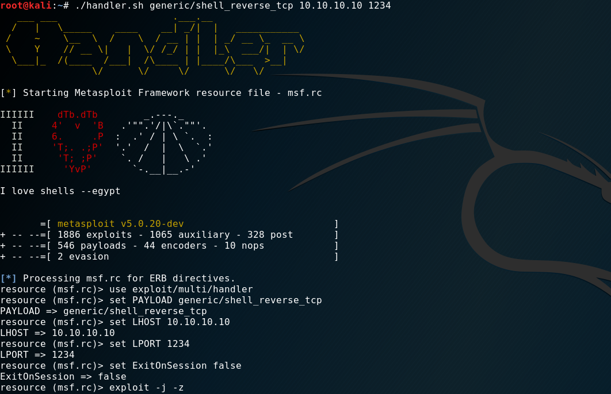

# handler.sh
* Simple Bash script
* Automates exploit/multi/handler setup
* Parse payload, ip & port

```
   ___ ___                    .___.__                 
  /   |   \_____    ____    __| _/|  |   ___________  
 /    ~    \__  \  /    \  / __ | |  | _/ __ \_  __ \ 
 \    Y    // __ \|   |  \/ /_/ | |  |_\  ___/|  | \/ 
  \___|_  /(____  /___|  /\____ | |____/\___  >__|    
                \/      \/     \/      \/   \/        

usage: ./handler.sh <payload> <ip> <port>

common payloads:
windows/meterpreter/reverse_tcp       windows/x64/meterpreter/reverse_tcp
linux/x64/meterpreter/reverse_tcp     linux/x86/metepreter/reverse_tcp
generic/shell_reverse_tcp             php/metepreter/reverse_tcp


```


